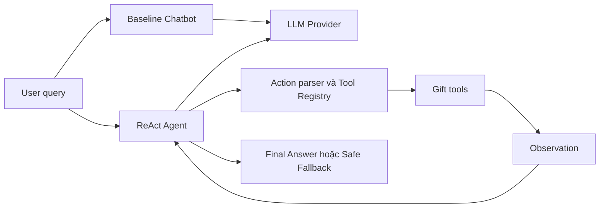

# LAB 03 E403 - CHATBOT VS REACT AGENT

Đề tài 3: **Trợ Lý Nắm Bắt Tính Cách & Chọn Quà Tặng Phù Hợp**

Ứng dụng so sánh hai cách xử lý cùng một bộ 5 test case:

- **Chatbot baseline:** một lần gọi LLM, không dùng công cụ.
- **ReAct Agent:** lặp `Thought -> Action -> Observation`, dùng dữ liệu từ kho
  quà mô phỏng trước khi trả lời.

## Trạng Thái

| Mốc | Nội dung | Trạng thái |
| :--- | :--- | :---: |
| 1 | Chọn đề tài và đánh giá Agentic Fit | Hoàn thành |
| 2 | Baseline Chatbot, Tool Specs và 5 test case | Hoàn thành |
| 3 | ReAct loop, parser, guardrails và trace | Hoàn thành |
| 4 | Cross-Audit nội bộ và Hybrid Flowchart | Hoàn thành kỹ thuật |

Cross-Audit với nhóm khác và nộp link repository là hoạt động trực tiếp, không
được giả lập hoặc đánh dấu thay trong mã nguồn.

## Cài Đặt

Yêu cầu Python 3.10 trở lên.

```powershell
python -m venv .venv
.\.venv\Scripts\Activate.ps1
python -m pip install -r requirements.txt
Copy-Item .env.example .env
```

Mặc định ứng dụng dùng `LLM_PROVIDER=mock`, chạy ngoại tuyến và không cần API
key. Để dùng Gemini, chỉnh `.env` cục bộ:

```dotenv
LLM_PROVIDER=gemini
GEMINI_API_KEY=<api-key-cua-ban>
LLM_MODEL=<model-id-duoc-tai-khoan-ho-tro>
```

Không commit `.env` hoặc API key.

## Chạy Dự Án

```powershell
python src/app.py
```

Ứng dụng chạy Chatbot baseline và ReAct Agent trên 5 câu hỏi trong
`config/test_cases.json`.

Chạy kiểm tra:

```powershell
python -m unittest discover -s tests -v
python src/tools.py
python -m pip check
```

Kết quả hiện tại:

- 5/5 test nghiệp vụ pass.
- 6/6 tình huống Cross-Audit nội bộ pass.
- Tool xử lý input lỗi bằng Observation/chuỗi `LỖI`, không làm ứng dụng crash.

## Kiến Trúc



ReAct Agent chỉ dispatch tool có trong `AVAILABLE_TOOLS`:

1. `save_recipient_profile`
2. `search_gifts`
3. `get_gift_details`
4. `save_shortlist`

Luồng multi-step chuẩn:

```text
save_recipient_profile
  -> search_gifts
  -> get_gift_details
  -> save_shortlist
  -> Final Answer
```

## Guardrails

- Giới hạn vòng lặp bằng `MAX_ITERATIONS`.
- Parse tham số bằng `literal_eval`, không dùng `eval`.
- Chỉ gọi tool trong `AVAILABLE_TOOLS`.
- Chặn Action lặp với cùng tham số.
- Kiểm tra ngân sách, mã quà, sở thích và prompt injection tại tầng tool.
- Từ chối yêu cầu mật khẩu hoặc truy cập dữ liệu riêng tư trước khi gọi provider.
- Trả safe fallback khi LLM lỗi hoặc hết số bước.

## Dữ Liệu Và Giới Hạn

Kho quà trong `src/tools.py` là dữ liệu mô phỏng, không phải tồn kho hoặc giá
thời gian thực. Baseline phải nói rõ giới hạn này. Agent chỉ được khẳng định dữ
liệu mà tool đã trả về.

Hồ sơ và shortlist chỉ lưu trong bộ nhớ của phiên chạy; dự án không lưu dữ liệu
người dùng lâu dài.

## Cấu Trúc Chính

```text
.
├── config/
│   └── test_cases.json
├── docs/
│   ├── CODELAB.md
│   ├── DANH_SACH_DE_TAI.md
│   ├── PHAN_CONG_CONG_VIEC.md
│   ├── hybrid_flowchart.mermaid
│   └── trace_eval.md
├── src/
│   ├── app.py
│   ├── prompts.py
│   ├── providers.py
│   └── tools.py
├── tests/
│   └── test_milestones.py
├── .env.example
└── requirements.txt
```

## Tài Liệu

- [Hướng dẫn thực hành](docs/CODELAB.md)
- [Phân công và checklist 4 mốc](docs/PHAN_CONG_CONG_VIEC.md)
- [Báo cáo trace và đánh giá](docs/trace_eval.md)
- [Hybrid Decision Flowchart](docs/hybrid_flowchart.mermaid)
